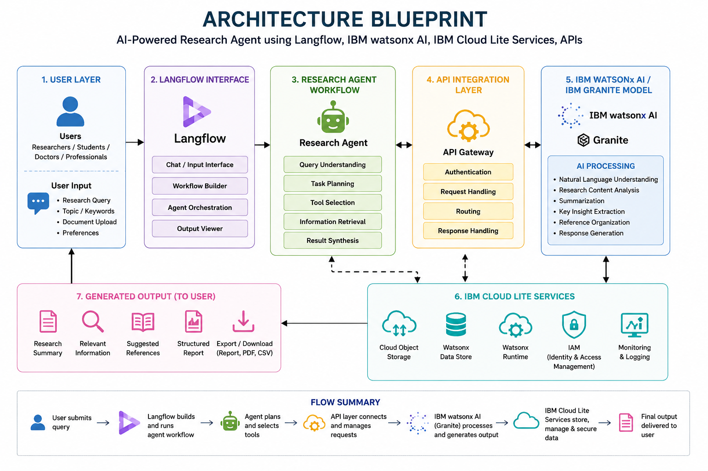

# Researchex-AI
### Smart AI-Powered Research Agent using IBM Granite & Langflow

---

## 📌 Project Overview
**Researchex-AI** is an advanced Agentic AI system developed under the **IBM Skills Build for University Engagements (AICTE-2026)** program. It specifically addresses **Problem Statement No.1: Research Agent**. 

The traditional research process involves manually scanning thousands of academic papers, summarizing complex literature, and managing extensive citations—a process that is highly time-consuming. **Researchex-AI** automates these core workflows by utilizing **Natural Language Processing (NLP)**, **Retrieval-Augmented Generation (RAG)**, and **Agentic Workflows** powered by **IBM Granite Models** via **IBM watsonx.ai**. It acts as an autonomous digital assistant for students, researchers, academics, and R&D professionals to accelerate scientific innovation.

---

## 🎯 Key Objectives & Core Features

- **🌐 Autonomous Literature Retrieval:** Smartly searches, fetches, and parses relevant research papers and academic literature across multi-domain research databases based on simple natural language queries.
- **📄 Advanced Document Summarization:** Condenses lengthy scientific articles, PDFs, and deep technical documents into precise, structured executive summaries highlighting hypotheses, methodologies, and key findings.
- **📊 Automatic Insights & Hypothesis Generation:** Analyzes existing research data to suggest new exploration pathways, correlations, and automated hypothesis definitions.
- **📑 Automated Citation & Reference Management:** Simplifies academic publishing workflows by automatically extracting metadata, formatting citations, and organizing bibliographies.
- **📋 Structured Report Generation:** Dynamically builds comprehensive R&D reports, structured literature reviews, and drafts critical sections for research manuscripts.

---

## 🏗️ System Architecture & Workflow

### 🗺️ Architecture Blueprint


---

### 💻 Data Flow & Component Interaction

```
[ User Input / Query ] 
       │
       ▼
┌────────────────────────────────────────────────────────┐
│               Langflow Orchestration Hub               │
│  ┌───────────────────────┐   ┌──────────────────────┐  │
│  │   Intent Classifier   │──>│ Query Optimizer Agent│  │
│  └───────────────────────┘   └──────────────────────┘  │
└────────────────────────────────────────────────────────┘
       │
       ├──────────────────────────────┐
       ▼                              ▼
┌──────────────────────────┐   ┌──────────────────────────┐
│  Academic Search APIs    │   │ Vector Database (RAG)    │
│  (ArXiv, PubMed, SemSch) │   │ (Document Embeddings)    │
│  Fetch Literature / PDFs  │   │ Contextual Knowledge Base│
└──────────────────────────┘   ┌──────────────────────────┐
       │                              │
       └──────────────┬───────────────┘
                      │ (Context + Prompts)
                      ▼
┌────────────────────────────────────────────────────────┐
│                     IBM watsonx.ai                     │
│           🤖 IBM Granite Large Language Model          │
└────────────────────────────────────────────────────────┘
                      │
                      ▼
┌────────────────────────────────────────────────────────┐
│                   Response Generation                  │
│  ┌──────────────────────┐     ┌─────────────────────┐  │
│  │  Structured Reports  │     │ Literature Summary  │  │
│  └──────────────────────┘     └─────────────────────┘  │
│  ┌──────────────────────┐     ┌─────────────────────┐  │
│  │ Verified Citations   │     │ Derived Hypotheses  │  │
│  └──────────────────────┘     └─────────────────────┘  │
└────────────────────────────────────────────────────────┘
```

### Detailed Workflow Execution:
1. **User Query Processing:** The researcher inputs a natural language query or research question into the system.
2. **Orchestration Layer (Langflow):** Langflow classifies the intent and triggers specialized sub-agents. It optimizes the prompt structures and determines whether external semantic searching or internal document parsing is required.
3. **Data Retrieval & Ingestion:**
   - **External Execution:** The agent interacts with research database APIs to scrape relevant metadata and document bodies.
   - **Internal Execution (RAG):** Uploaded research articles are vectorized into numerical embeddings and indexed inside a high-performance vector store for strict, grounded contextual responses.
4. **Cognitive LLM Processing (IBM watsonx.ai):** The accumulated context, along with optimized system prompts, is passed down to the **IBM Granite Model**. The model acts as the reasoning engine to process technical terminology, extract complex insights, and perform synthesis.
5. **Output Generation:** the agent structures the final payload into human-readable text, downloadable reports, references, or synthesized comparative tables.

---

## 🛠️ Technology Stack & Infrastructure

- **Orchestration Framework:** Langflow (Multi-agent visual orchestration and pipeline construction)
- **AI Reasoning Core Engine:** IBM watsonx.ai
- **Foundational LLM:** IBM Granite Model (`ibm/granite-8b-code-instruct` optimized for enterprise and reasoning)
- **Cloud Infrastructure:** IBM Cloud Lite Services (Watson Machine Learning, Object Storage)
- **Programming Environment:** Python & Enterprise REST APIs
- **Target Application Domain:** Artificial Intelligence / Natural Language Processing / Research Automation

---

## 📂 Repository Directory Structure

```directory
researchex-ai/
├── problem_statement.pdf                # Original AICTE problem statement guide
├── architecture-blueprint.png           # Visual system architecture diagram
├── project_presentation.pptx            # Technical presentation deck for evaluators
├── app.json                             # Application configuration and technology metadata
└── README.md                            # Comprehensive project overview and documentation
```

---

## 🚀 Getting Started & Configuration

### Prerequisites
- Python 3.10 or higher
- An active **IBM Cloud Lite Account**
- API Access credentials for **IBM watsonx.ai**
- Langflow installed locally or accessible via cloud hosting

### Installation & Flow Ingestion
1. **Clone the Repository:**
   ```bash
   git clone https://github.com/theunstopabble/Researchex-AI.git
   cd Researchex-AI
   ```
2. **Environment Variables Configuration:**
   Create a `.env` file in your project directory and set up your IBM Watsonx credentials:
   ```env
   WATSONX_APIKEY=your_ibm_cloud_api_key_here
   WATSONX_PROJECT_ID=your_watsonx_project_id_here
   WATSONX_URL=https://us-south.ml.cloud.ibm.com # Or your respective regional URL
   ```
3. **Import Flow into Langflow:**
   - Open your Langflow dashboard environment.
   - Click on **Upload / Import** and select the provided flow pipeline JSON from the repository source folder.
   - Ensure the API nodes are fully populated with your environmental keys.
   - Build and run the entry node to start interacting with **Researchex-AI**.

---

## 🔮 Future Scope & Roadmap

- **🗣️ Voice-Driven Interactions:** Integrating speech-to-text and text-to-speech multi-modal channels for seamless hands-free scientific querying.
- **📚 Real-Time Global Journal Sync:** Direct live synchronization hooks with premier closed-source and open-source scientific portals (like IEEE Xplore, ScienceDirect, and Springer Link).
- **👥 Multi-Agent Collaborative Workspaces:** Developing independent agent sandboxes where multiple specialized agents (e.g., Data Analyst Agent, Code Review Agent, Technical Writer Agent) coordinate to write entire collaborative papers.
- **📊 Interactive Data Visualization Modules:** Enabling automated generation of research graphs, visual trends, and comparative matrix dashboards derived dynamically from unstructured data arrays.

---

## 👤 Developer & Contact Info

- **Developer Name:** Gautam Kumar
- **GitHub:** [@theunstopabble](https://github.com/theunstopabble)
- **LinkedIn:** [gautamkr62](https://www.linkedin.com/in/gautamkr62/)
- **Portfolio:** [gautam-kr.vercel.app](https://gautam-kr.vercel.app/)
- **Project Scope:** Submission for IBM Skills Build University Engagement (AICTE-2026)
